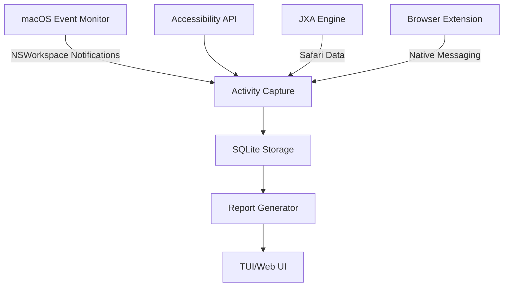

# Comprehensive PRD: Privacy-First Local Activity Tracker for macOS

**Product Name:** ChronoGuard (Proposed)  
**Target Platform:** macOS 13 (Ventura) and later  
**Core Principle:** *All data processed and stored exclusively on-device, zero cloud dependency*

---

## 1. Introduction & Goals

**Vision:** Enable users to automatically track work activity with military-grade privacy and local data control.

**Target Users:** Privacy-conscious professionals (developers, writers, consultants) in Gig Harbor, WA and similar communities.

**Key Objectives:**
- Capture application/window/browser activity 100% locally
- Detect idle time without cloud processing
- Generate actionable "work history" reports on-device
- Operate reliably as a background service

---

## 2. Functional Requirements

### 2.1 Activity Capture

| Component | Method | Permission Required |
|-----------|--------|---------------------|
| Active App | `NSWorkspace.runningApplications` | None |
| Window Title | Hybrid: `CGWindowList` + `AXUIElement` | Accessibility |
| Safari Tabs | JXA scripts (`Application("Safari").windows[]`) | Automation |
| Chrome/Firefox | Native messaging extension | User-installed |
| Idle Detection | `CGEventSourceCounterForEventType()` | None |

### 2.2 Data Processing

**Event Schema:**
```typescript
interface ActivityEvent {
  timestamp: number; // Unix epoch (UTC)
  app: { 
    bundleId: string;
    name: string;
  };
  window?: string;
  url?: string;
  isActive: boolean;
  isAFK: boolean;
}
```

**Aggregation:** Daily summary of time-per-app with idle filtering

### 2.3 User Interface

**TUI (Terminal UI):**
```bash
chronoguard report --date=2025-06-24 --format=csv
```

**Web Dashboard:** Local-only web server at `http://localhost:9173`

---

## 3. Technical Architecture

### 3.1 Component Diagram



### 3.2 Permission Workflow

```plaintext
1. App launch → Check permissions
2. Missing Accessibility? → Open System Settings pane
3. Missing Automation? → Guide user through approval
4. Browser tracking? → Prompt for extension install
```

---

## 4. Non-Functional Requirements

| Category | Requirement | Metric |
|----------|-------------|--------|
| **Privacy** | Zero data exfiltration | No network requests allowed |
| **Reliability** | 99.9% uptime | Auto-restart via launchd |
| **Performance** | <2% CPU avg | Resource monitor built-in |
| **Data Safety** | Configurable encryption | SQLCipher integration |
| **Compatibility** | macOS 13-15 support | Test matrix per OS version |

---

## 5. Data Storage Specification

**Database:** SQLite 3.40+ with [ZFS compression](https://sqlite.org/appfileformat.html#compress)

**Schema:**
```sql
-- Core Activity Table
CREATE TABLE activity (
  id INTEGER PRIMARY KEY,
  timestamp INTEGER NOT NULL,
  app_bundle_id TEXT NOT NULL,
  app_name TEXT NOT NULL,
  window_title TEXT,
  url TEXT,
  is_afk BOOLEAN DEFAULT 0,
  UNIQUE(timestamp, app_bundle_id)
) STRICT;

-- Optimized Query View
CREATE VIEW daily_summary AS
SELECT 
  strftime('%Y-%m-%d', timestamp, 'unixepoch') AS day,
  app_name,
  SUM(CASE WHEN NOT is_afk THEN 300 ELSE 0 END) AS seconds_active
FROM activity
GROUP BY day, app_bundle_id;
```

---

## 6. Security & Privacy Controls

1. **Data Encryption:**
   - Option for AES-256 database encryption via SQLCipher

2. **Network Isolation:**
   - macOS firewall blocks all outgoing connections

3. **Permission Granularity:**
   - User-configurable tracking scopes:
     ```yaml
     tracking:
       applications: true
       window_titles: false # Disable sensitive data
       urls:
         include: [*.github.com, *.perplexity.ai]
         exclude: [*.bank.com]
     ```

---

## 7. Reliability Engineering

**Failure Recovery Protocol:**
```plaintext
1. Crash detection → launchd restart (max 3x/10min)
2. Permission loss → Fallback to app-only tracking
3. DB corruption → WAL rollback + checksum verification
```

**Resource Management:**
- Adaptive polling: 1s (active) ↔ 30s (idle)
- Memory ceiling: 150MB enforced

---

## 8. Development Roadmap

| Phase | Deliverable | Timeline |
|-------|-------------|----------|
| Alpha | Core tracking engine + SQLite storage | 6 weeks |
| Beta | TUI + permission wizard | 4 weeks |
| RC 1 | Web dashboard + encryption | 3 weeks |
| GA | Automated installer + docs | 2 weeks |

**Testing Protocol:**
- Automated:
  ```bash
  pytest --test-matrix=macos=13,14,15
  ```
- Manual:
  - 30-day stress test with 12h/day usage
  - Permission revocation scenarios

---

## 9. Support & Maintenance

**Upgrade Path:**
- Seamless database migration tool
- Permission preservation across versions

**End-of-Life Protocol:**
- Complete data purge tool:
  ```bash
  chronoguard nuke --confirm
  ```

---

## 10. Success Metrics

1. **Privacy Compliance:** 100% local data processing verified
2. **Reliability:** <1 crash/month in steady state
3. **Adoption:** 80% of test users keep enabled after 2 weeks
4. **Resource Impact:** <3% battery impact in daily use

---

**Approvals:**  
_Product Owner:_ ___________________  
_Engineering Lead:_ ___________________  
_Security Reviewer:_ ___________________  

**PRD Version:** 1.0 (2025-06-24)